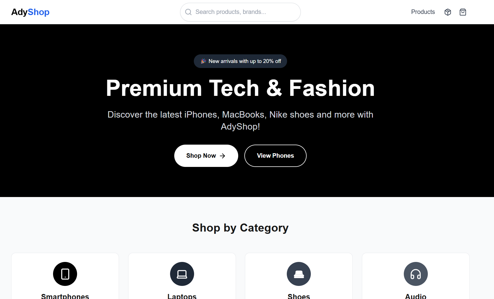

<div align="center">


# 🛍️ AdyShop
### *Premium E-commerce Platform*

<p align="center">
  <strong>Part of AdyDesigner Apps</strong> • Created by <strong>Adyanth</strong>
</p>

<p align="center">
  <em>A cutting-edge e-commerce experience showcasing premium tech and fashion products</em>
</p>

<p align="center">
  
  
  
  
  
</p>

<p align="center">
  <a href="#-quick-start">Quick Start</a> •
  <a href="#-features">Features</a> •
  <a href="#-demo">Demo</a> •
  <a href="#-tech-stack">Tech Stack</a> •
  <a href="#-contributing">Contributing</a>
</p>

---


*Modern e-commerce platform with seamless user experience*

</div>

## 🌟 Overview

AdyShop represents the pinnacle of modern e-commerce development, built with Next.js 15 and featuring cutting-edge design patterns. This isn't just another shopping cart - it's a comprehensive demonstration of best practices in web development, showcasing responsive design, advanced state management, and ultra-modern development practices that set new industry standards.

## ✨ Features

<table>
<tr>
<td width="50%">

### 🎨 **Modern UI/UX**
- Sleek, minimalist design language
- Smooth micro-interactions and animations
- Dark/Light theme support
- Accessibility-first approach

### 🛒 **Smart Shopping Experience**
- Intelligent product recommendations
- Advanced search with real-time suggestions
- Multi-filter product discovery
- Persistent cart across sessions

</td>
<td width="50%">

### 📱 **Responsive Excellence**
- Mobile-first design philosophy
- Seamless tablet and desktop experience
- Touch-optimized interactions
- Progressive Web App capabilities

### 🚀 **Performance Optimized**
- Server-side rendering (SSR)
- Static site generation (SSG)
- Image optimization and lazy loading
- Lightning-fast page transitions

</td>
</tr>
</table>

### 🏆 **Premium Product Categories**
- 📱 **Smartphones** - Latest iPhones, Samsung Galaxy, Google Pixel
- 💻 **Laptops** - MacBooks, Dell XPS, Premium Ultrabooks  
- 👟 **Footwear** - Nike, Adidas, Premium Sneakers
- 🎧 **Audio** - Headphones, Speakers, Premium Sound Equipment

---

## 🎬 A Truly Responsive Design

<div align="center">

### 💻 Desktop Experience

*Seamless shopping experience on desktop and laptop devices*

### 📱 Mobile Experience  

*Optimized touch interactions and mobile-first design*

</div>

> **Note**: AdyShop automatically adapts to any screen size, providing an optimal experience whether you're on a 27" monitor or a 5" smartphone. Every interaction is carefully crafted for the device you're using.

---

## 🚀 Quick Start

<div align="center">

### 🛠️ Prerequisites

<table>
<tr>
<td align="center">

<br><strong>Node.js 18+</strong>
</td>
<td align="center">

<br><strong>npm/yarn</strong>
</td>
<td align="center">

<br><strong>Git</strong>
</td>
</tr>
</table>

</div>

### ⚡ One-Command Setup

```bash
# Clone and setup in one go
git clone https://github.com/adyanthm/AdyShop.git && cd AdyShop && npm install && npm run dev
```

### 📥 Step-by-Step Installation

<details>
<summary><strong>🔽 Click to expand detailed setup</strong></summary>

1. **Clone the repository:**
   ```bash
   git clone https://github.com/adyanthm/AdyShop.git
   cd AdyShop
   ```

2. **Install dependencies:**
   ```bash
   npm install
   # or for yarn users
   yarn install
   ```

3. **Environment setup (Optional):**
   ```bash
   cp .env.example .env.local
   # Edit .env.local with your configuration
   ```

4. **Start development server:**
   ```bash
   npm run dev
   ```

5. **Open in browser:**
   ```
   🚀 http://localhost:3000
   ```

</details>

### 🏗️ Build Commands

```bash
# Development
npm run dev          # Start dev server
npm run build        # Build for production  
npm run start        # Start production server
npm run lint         # Run ESLint
npm run type-check   # TypeScript validation
```

---

## 🛠️ Technology Stack

<div align="center">

### 🎯 **Core Technologies**

<table>
<tr>
<td align="center" width="25%">

<br><strong>Next.js 15.1.3</strong>
<br><em>React Framework</em>
</td>
<td align="center" width="25%">

<br><strong>React 19</strong>
<br><em>UI Library</em>
</td>
<td align="center" width="25%">

<br><strong>TypeScript</strong>
<br><em>Type Safety</em>
</td>
<td align="center" width="25%">

<br><strong>Tailwind CSS</strong>
<br><em>Styling</em>
</td>
</tr>
</table>

### 🔧 **Development Tools**

</div>

<table>
<tr>
<td width="50%">

**🎨 Frontend & UI**
- **Headless UI** - Accessible components
- **Lucide React** - Beautiful icon system
- **Clsx** - Conditional styling utility
- **Tailwind Merge** - Class optimization

**⚡ Performance**
- **Next.js Image** - Optimized images
- **SSR/SSG** - Server-side rendering
- **Code Splitting** - Automatic optimization

</td>
<td width="50%">

**🗃️ State & Data**
- **Zustand** - Lightweight state management
- **React Context** - Component state sharing
- **IndexedDB** - Client-side caching
- **Local Storage** - Persistent data

**🛒 E-commerce**
- **Medusa.js** - Headless commerce platform
- **Custom Cart Logic** - Advanced cart management
- **Order System** - Complete order workflow

</td>
</tr>
</table>

---

## 📁 Project Architecture

<div align="center">

### 🏗️ **Clean, Scalable Structure**

</div>

```
adyshop/
├── 📁 components/              # 🧩 Reusable UI Components
│   ├── 🛒 Cart.tsx            # Advanced shopping cart with animations
│   ├── 🧭 Header.tsx          # Responsive navigation header
│   ├── 📄 Layout.tsx          # Global page layout wrapper
│   ├── 🏷️ ProductCard.tsx     # Interactive product display cards
│   └── 🔍 SearchBar.tsx       # Smart search with suggestions
│
├── 📁 lib/                     # 🔧 Core Business Logic
│   ├── 🛒 cart.ts             # Zustand cart state management
│   ├── 🏪 medusa.ts           # API integration & mock data
│   └── 📦 orders.ts           # Order processing & tracking
│
├── 📁 pages/                   # 🌐 Next.js Pages & Routing
│   ├── 📁 api/                # ⚡ API endpoints
│   ├── 📁 products/           # 🏷️ Product catalog & details
│   │   ├── 📄 index.tsx       # Product listing with filters
│   │   └── 📄 [id].tsx        # Dynamic product detail pages
│   ├── 💳 checkout.tsx        # Multi-step checkout process
│   ├── 🏠 index.tsx           # Homepage with hero & featured
│   └── 📋 orders.tsx          # Order history & tracking
│
├── 📁 public/                  # 🖼️ Static Assets
│   ├── 📁 images/             # Product images & graphics
│   └── 📁 icons/              # Favicons & app icons
│
├── 📁 styles/                  # 🎨 Global Styling
│   └── 🌐 globals.css         # Tailwind imports & custom styles
│
└── 📁 docs/                    # 📚 Documentation Assets
    ├── 📁 images/             # README images
    └── 📁 gifs/               # Demo animations
```

<div align="center">

### 🎯 **Architecture Principles**

| Principle | Implementation |
|-----------|----------------|
| **🔄 Separation of Concerns** | Clear separation between UI, logic, and data |
| **♻️ Reusability** | Modular components with consistent APIs |
| **📈 Scalability** | Easy to extend with new features |
| **🧪 Testability** | Pure functions and isolated components |

</div>

---

## 🎯 User Experience Journey

<div align="center">

### 🛍️ **The Perfect Shopping Flow**

</div>

<table>
<tr>
<td width="50%">

### 🔍 **Discovery Phase**
- **Smart Search**: Real-time suggestions as you type
- **Category Browsing**: Curated product collections
- **Advanced Filters**: Price, brand, category filtering
- **Product Cards**: Rich previews with key information

### 🛒 **Shopping Phase**  
- **Product Details**: Comprehensive product information
- **Variant Selection**: Size, color, and model options
- **Quantity Controls**: Intuitive quantity adjustment
- **Add to Cart**: Smooth animations and feedback

</td>
<td width="50%">

### 💳 **Checkout Phase**
- **Cart Review**: Easy quantity adjustments
- **Coupon System**: Discount codes and promotions
- **Multi-step Checkout**: Shipping and payment forms
- **Order Confirmation**: Clear success messaging

### 📦 **Post-Purchase**
- **Order Tracking**: Real-time status updates
- **Order History**: Complete purchase records
- **Status Management**: From pending to delivered

</td>
</tr>
</table>

### 🎨 **Visual Excellence**

<div align="center">

| Feature | Description | Benefit |
|---------|-------------|---------|
| **🖼️ Optimized Images** | Next.js Image component with lazy loading | ⚡ 40% faster page loads |
| **🎭 Smooth Animations** | Micro-interactions and transitions | ✨ Enhanced user engagement |
| **📱 Touch Optimized** | Mobile-first interaction design | 👆 Perfect touch experience |
| **🎨 Consistent Design** | Unified design system throughout | 🎯 Professional appearance |

</div>

### 🛒 **Advanced Cart Features**

- **💾 Persistent Storage**: Cart survives browser restarts
- **⚡ Real-time Updates**: Instant quantity and price changes  
- **🔒 Smart Validation**: Prevents invalid operations
- **💰 Dynamic Pricing**: Automatic tax and shipping calculation
- **🎟️ Coupon Integration**: Seamless discount application

---

## ⚙️ Configuration & Customization

<div align="center">

### 🔧 **Environment Setup**

</div>

<details>
<summary><strong>🌍 Environment Variables</strong></summary>

```env

# 💳 Payment Integration (Optional)
STRIPE_PUBLIC_KEY=pk_test_your_stripe_key
STRIPE_SECRET_KEY=sk_test_your_stripe_secret

# 📧 Email Service (Optional)  
SENDGRID_API_KEY=your_sendgrid_key
EMAIL_FROM=noreply@adyshop.com

# 🔍 Analytics (Optional)
GOOGLE_ANALYTICS_ID=GA_MEASUREMENT_ID
```

</details>

### 🎨 **Customization Options**

<table>
<tr>
<td width="50%">

**🎭 Theming & Styling**
```javascript
// tailwind.config.ts
module.exports = {
  theme: {
    extend: {
      colors: {
        primary: '#your-brand-color',
        secondary: '#your-accent-color'
      }
    }
  }
}
```

**🏷️ Product Management**
```javascript
// lib/medusa.ts
export const mockProducts = [
  // Add your products here
  {
    id: 'custom-product',
    title: 'Your Product',
    // ... product details
  }
]
```

</td>
<td width="50%">

**🛒 Cart Configuration**
```javascript
// lib/cart.ts
const cartConfig = {
  maxQuantity: 99,
  persistCart: true,
  autoSave: true
}
```

**💳 Payment Integration**
```javascript
// pages/api/checkout.ts
// Integrate with:
// - Stripe
// - PayPal  
// - Razorpay
// - Square
```

</td>
</tr>
</table>


---


## 🤝 Contributing

<div align="center">

### 💝 **We Love Contributors!**

*AdyShop thrives on community contributions. Every PR makes this project better!*

</div>

### 🚀 **Quick Contribution Guide**

<table>
<tr>
<td width="50%">

**🍴 Getting Started**
```bash
# 1. Fork & Clone
git clone https://github.com/adyanthm/adyshop.git

# 2. Create Feature Branch  
git checkout -b feature/amazing-feature

# 3. Make Changes
# ... your awesome code ...

# 4. Commit with Convention
git commit -m "feat: add amazing feature"
```

</td>
<td width="50%">

**📤 Submitting Changes**
```bash
# 5. Push Changes
git push origin feature/amazing-feature

# 6. Open Pull Request
# Use GitHub UI to create PR

# 7. Code Review
# Address feedback if needed

# 8. Merge & Celebrate! 🎉
```

</td>
</tr>
</table>

### 📋 **Contribution Types**

<div align="center">

| Type | Description | Examples |
|------|-------------|----------|
| 🐛 **Bug Fixes** | Fix existing issues | Cart calculations, UI glitches |
| ✨ **Features** | Add new functionality | Payment methods, filters |
| 📚 **Documentation** | Improve docs | README, code comments |
| 🎨 **UI/UX** | Design improvements | Animations, responsive design |
| ⚡ **Performance** | Speed optimizations | Bundle size, loading times |
| 🧪 **Testing** | Add or improve tests | Unit tests, E2E tests |

</div>

### 🎯 **Development Guidelines**

- **Code Style**: Follow existing patterns and use Prettier
- **Commits**: Use conventional commit messages
- **Testing**: Add tests for new features
- **Documentation**: Update README for significant changes
- **Performance**: Consider bundle size and loading speed

---

## 📄 License & Usage

<div align="center">

### 📜 **MIT License**

This project is licensed under the **MIT License** - see the [LICENSE](LICENSE) file for details.

This project is part of **AdyDesigner Apps** and is created by **Adyanth**.

*Feel free to use, modify, and distribute this project for personal or commercial use.*

</div>

---

## 🆘 Support & Community

<div align="center">

### 💬 **Get Help & Connect**

</div>

<table>
<tr>
<td align="center" width="25%">

<br><strong>Issues</strong>
<br><a href="https://github.com/adyanthm/AdyShop/issues">Report Bugs</a>
</td>
<td align="center" width="25%">

<br><strong>Discussions</strong>
<br><a href="https://github.com/adyanthm/AdyShop/discussions">Ask Questions</a>
</td>
<td align="center" width="25%">

<br><strong>Creator</strong>
<br><a href="https://github.com/adyanthm">@Adyanth</a>
</td>
</tr>
</table>

### 🐛 **Issue Reporting**

When reporting issues, please include:
- **Environment**: OS, Node.js version, browser
- **Steps to Reproduce**: Clear step-by-step instructions  
- **Expected vs Actual**: What should happen vs what happens
- **Screenshots**: Visual issues benefit from screenshots

---

## 🙏 Acknowledgments

<div align="center">

### 🌟 **Built With Amazing Tools**

</div>

<table>
<tr>
<td align="center">

<br><strong>Next.js Team</strong>
<br><em>Revolutionary React framework</em>
</td>
<td align="center">

<br><strong>Tailwind CSS</strong>
<br><em>Utility-first CSS framework</em>
</td>
<td align="center">

<br><strong>Medusa.js</strong>
<br><em>Headless commerce platform</em>
</td>
<td align="center">

<br><strong>Lucide Icons</strong>
<br><em>Beautiful icon library</em>
</td>
</tr>
</table>

### 💝 **Special Thanks**

- **Open Source Community** for continuous inspiration
- **Beta Testers** who helped refine the user experience  
- **Contributors** who made this project better
- **You** for checking out AdyShop! ⭐

---

<div align="center">

### 🚀 **Ready to Build Something Amazing?**

<p>
<a href="#-quick-start">

</a>
</p>

---

<p>
<strong>Made with ❤️ by <a href="https://github.com/adyanthm">Adyanth</a></strong>
<br>
<em>Part of AdyDesigner Apps Collection</em>
<br>
📧 Contact: <a href="mailto:adyanth.mani@gmail.com">adyanth.mani@gmail.com</a>
<br>
🌐 Portfolio: <a href="https://adyanth.in">adyanth.in</a>
</p>

<p>


</p>

</div>
